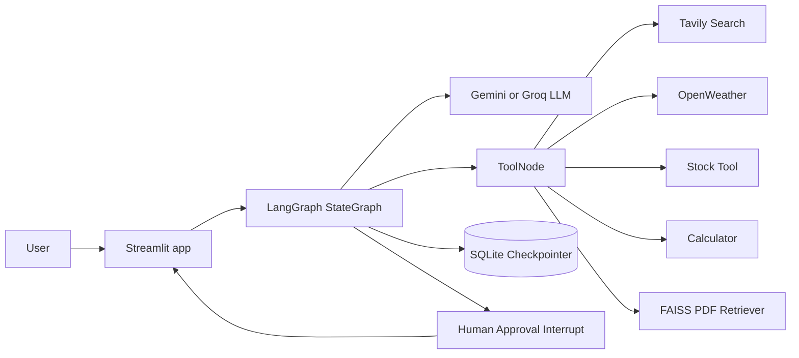

# LangGraph Agentic Chatbot

A Streamlit chatbot project that grows from a simple LangGraph assistant into a tool-using, document-aware, human-approved agent workflow. The project demonstrates conversation memory, tool calling, PDF RAG, external APIs, and human-in-the-loop approval with LangGraph checkpoints.

## Highlights

- Multi-turn chat powered by LangGraph and LangChain message state
- Streamlit UI with conversation threads and persisted chat history
- Tool calling for web search, calculator, stocks, and live weather
- PDF upload and retrieval-augmented generation with FAISS
- Human-in-the-loop approval flow for stock purchase actions
- SQLite checkpointing for durable graph state across reruns
- Separate app variants for learning each feature step by step

## Demo Flow

Try the full version first:

```bash
streamlit run app_hitl.py
```

Then ask things like:

```text
What is the current weather in Mumbai?
Search the web for latest AI news.
Calculate 42 * sin(1.2).
Upload a PDF and ask: summarize the main points.
Buy 5 shares of AAPL.
```

For purchase requests, the graph pauses and the UI asks for human approval before continuing.

## Project Structure

| File | Purpose |
| --- | --- |
| `app_hitl.py` | Full Streamlit app with tools, PDF upload, threads, RAG, and HITL approval |
| `chatbot_with_hitl.py` | LangGraph backend used by `app_hitl.py` |
| `app_rag.py` | Streamlit app with PDF upload and RAG support |
| `agentic_chatbot_rag_backend.py` | RAG backend with FAISS, tools, and SQLite checkpointing |
| `app_tool.py` | Streamlit app focused on tool-calling chat |
| `agentic_chatbot_tool_backend.py` | Tool backend for search, calculator, stocks, and weather |
| `app_db.py` | Chat app with SQLite-backed conversation persistence |
| `agentic_chatbot_db_backend.py` | Basic LangGraph chatbot with SQLite checkpointing |
| `app_thread.py` | Threaded chat UI using the basic backend |
| `app.py` | Minimal Streamlit chatbot app |
| `agentic_chatbot_backend.py` | Minimal LangGraph chatbot backend |
| `chatbot_without_hitl.py` | Full tool and RAG backend without approval interrupts |
| `Chatbot_workflow.ipynb` | Notebook exploration of the chatbot workflow |
| `tools_demo.ipynb` | Notebook exploration of tool calling examples |
| `faiss_db/` | Local FAISS vector index generated from uploaded PDFs |
| `chatbot.db` | SQLite checkpoint database for persisted graph state |

## Architecture



## App Variants

| Run command | Best for | Features |
| --- | --- | --- |
| `streamlit run app_hitl.py` | Main demo | Threads, tools, RAG, PDF upload, HITL approval |
| `streamlit run app_rag.py` | Document Q&A | Threads, PDF upload, FAISS RAG, tools |
| `streamlit run app_tool.py` | Tool calling | Search, calculator, stock lookup, weather |
| `streamlit run app_db.py` | Persistent chat | SQLite checkpoints and conversation history |
| `streamlit run app_thread.py` | Threaded chat basics | Sidebar conversations with basic chat |
| `streamlit run app.py` | Minimal starter | Simple LangGraph chat UI |

## Tech Stack

- Python 3.13
- Streamlit
- LangGraph
- LangChain
- Google Gemini via `langchain-google-genai`
- Groq via `langchain-groq`
- FAISS for local vector search
- SQLite for checkpointing
- Tavily Search API
- OpenWeather API
- Python dotenv for local secrets

## Setup

### 1. Create a virtual environment

```bash
python -m venv .venv
.\.venv\Scripts\activate
```

On macOS or Linux:

```bash
python -m venv .venv
source .venv/bin/activate
```

### 2. Install dependencies

Recommended, because this repository includes `pyproject.toml` and `uv.lock`:

```bash
uv sync
```

Or use pip with the project metadata:

```bash
pip install -e .
```

The `requirements.txt` file is kept for compatibility with earlier experiments. For the full Streamlit apps, prefer `uv sync` or `pip install -e .` because `pyproject.toml` is the most complete dependency source.

### 3. Configure environment variables

Copy the example file:

```bash
copy .env.example .env
```

On macOS or Linux:

```bash
cp .env.example .env
```

Fill in the keys you need:

```env
GOOGLE_API_KEY=your-google-api-key
GROQ_API_KEY=your-groq-api-key
TAVILY_API_KEY=your-tavily-api-key
ALPHA_VANTAGE_API_KEY=your-alpha-vantage-api-key
WEATHER_API_KEY=your-openweathermap-api-key
```

Notes:

- `app_hitl.py`, `app_rag.py`, `chatbot_with_hitl.py`, and `chatbot_without_hitl.py` use Gemini and require `GOOGLE_API_KEY`.
- `app.py`, `app_thread.py`, `app_db.py`, and `app_tool.py` use Groq and require `GROQ_API_KEY`.
- Search requires `TAVILY_API_KEY`.
- Weather requires `WEATHER_API_KEY` or `OPENWEATHER_API_KEY`.
- LangSmith tracing variables are optional. Disable tracing if you do not want remote trace logging.

## Running the Main App

```bash
streamlit run app_hitl.py
```

Open the local Streamlit URL shown in your terminal, usually:

```text
http://localhost:8501
```

## Using PDF RAG

1. Run `app_hitl.py` or `app_rag.py`.
2. Attach a PDF using the chat input upload button.
3. Wait for the processing toast.
4. Ask questions about the uploaded document.

The app splits the PDF, creates embeddings, and stores the FAISS index in `faiss_db/`.

## Human-in-the-Loop Approval

The HITL workflow is implemented in `chatbot_with_hitl.py` with LangGraph `interrupt()`.

When the user asks to buy stock, the graph pauses:

```text
Buy 5 shares of AAPL.
```

The Streamlit UI displays approval controls. Choosing approve or reject resumes the same checkpointed graph thread with `Command(resume=...)`.

## Useful Prompts

```text
What is the weather in London?
Search the web for today's top technology news.
What is the stock price of MSFT?
Calculate sqrt(144) + 18 / 3.
I uploaded a PDF. What are the key takeaways?
Buy 2 shares of TSLA.
```

## Troubleshooting

### Weather API key is missing

Make sure `.env` contains one of these:

```env
WEATHER_API_KEY=your-openweathermap-api-key
OPENWEATHER_API_KEY=your-openweathermap-api-key
```

Restart Streamlit after changing `.env`.

### OpenWeather returns an invalid or inactive key error

New OpenWeather keys can take a little time to activate. Also verify that the key belongs to the OpenWeather account and plan you are using.

### PDF questions return no relevant information

Upload the PDF again from `app_hitl.py` or `app_rag.py`. The FAISS index is stored locally in `faiss_db/`, so deleting that folder clears the document memory.

### LangSmith connection warnings

If tracing is enabled but your machine cannot reach LangSmith, the app can still answer, but you may see trace upload warnings. Set tracing off in `.env` if needed:

```env
LANGSMITH_TRACING=false
```

### Streamlit still shows old behavior

Stop the running Streamlit process and restart it so Python reloads the edited backend modules:

```bash
streamlit run app_hitl.py
```

## Development Notes

- The codebase intentionally keeps separate files for each learning stage.
- `chatbot.db` stores SQLite checkpoints and conversation state.
- `faiss_db/` stores the current local PDF vector index.
- `.env` should stay local and should not be committed.
- The current stock purchase tool is a demo action, not a real brokerage integration.

## Roadmap Ideas

- Move duplicated tools into a shared `tools.py` module
- Read the stock API key directly from `ALPHA_VANTAGE_API_KEY`
- Add automated tests for weather parsing and HITL resume behavior
- Add a cleaner conversation title instead of raw thread IDs
- Add document collection management for multiple uploaded PDFs

## License

Add your preferred license before publishing this project.
